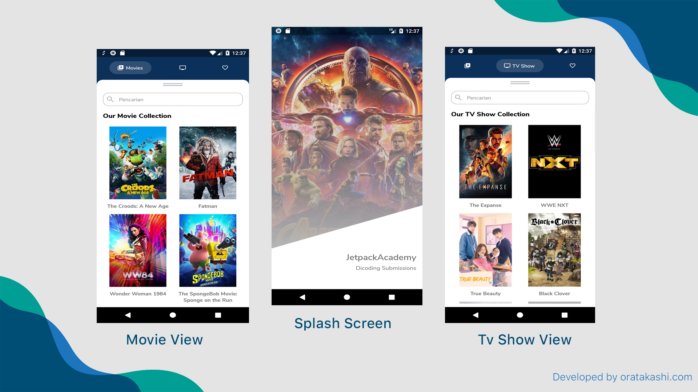

<p align="center">
  <a href="#">
		<h1 align="center">Jetpack Academy</h1>
  </a>
</p>
<p align="center">
  Jetpack Academy merupakan aplikasi Submission dari Kelas Belajar Android Jetpack Pro, Repository ini di bagi menjadi 3 branch, branch submission 1 untuk submission 1, branch submission 2 untuk submission 2 dan branch submission 3 untuk submission final, dan branch main adalah branch utama.
</p>
<span align="center">
 <hr>
 <p align="center"></p>
 <p align="center">Screenshot</p>
 <hr>
  <p align="center"></p>
 <p align="center">Screenshot</p>
 <hr>
   <p align="center"></p>
 <p align="center">Screenshot</p>
 <hr>
   <p align="center"></p>
 <p align="center">Screenshot</p>
 <hr>
 </span>
 <h1>Download Demo</h1>
 https://download.oratakashi.com/jetpackAcademy.apk
 <br>
 
 
 ### Apps Feature:

- Find Movie
- List Up Comming Movie
- Find Tv Show
- List Up Coming Tv Show
- Favorite Movie dan Tv Show
 

  ### Setup
  1. Anda harus membuat API Key The Movie DB pada situs <a href="https://www.themoviedb.org/signup">TMDB Register</a>
  2. Masukkan Api Key yang sudah dibuat pada config seperti berikut:
	 **core/Config.kt**
```kotlin
object Config {
    const val key : String = "{{YOUR API KEY}}"
}
```
<br>
 <h1>Creator</h1>
 <p>Jetpack Academy is created by [Oratakashi](http://github.com/oratakashi)</p>
 <p>You can contact me at : oratakashi@oratakashi.com</p>
 <h1>License</h1>
 <p>Jetpack Academy Apps is under the [GPL3 License](LICENSE)</p>
